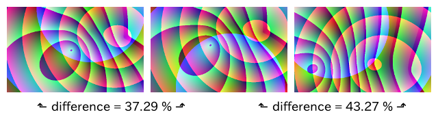
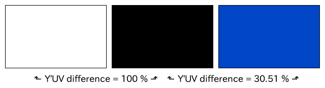
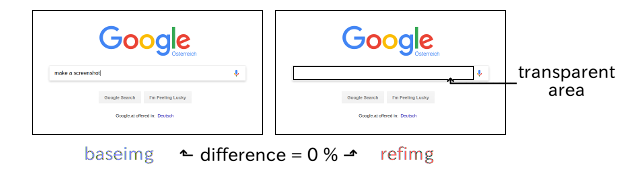

README image:https://api.travis-ci.org/meisterluk/screenshot-compare.svg?branch=master[travis test result]
==========================================================================================================

author::
  grml solutions
version::
  1.0.0

What is it about?
-----------------

You can compare two image files and it will show a difference score between 0 and 1.
Using transparent reference PNG images, you can also skip certain areas of the file.
Unlike the title, you can compare arbitrary images, but our usecase is screenshot comparison.

Why do you use it?
------------------

We take screenshots of running live systems and check whether they are (visually) in a certain state.

Who should use it?
------------------

Especially software developers testing software might find this software useful.
Consider that Mozilla Firefox's just got a link:https://developer.mozilla.org/en-US/Firefox/Headless_mode[headless mode] and soon you will be able to take screenshots.
Chromium link:https://github.com/GoogleChrome/puppeteer[has it already]. So web developer might find it useful as well.

Understanding the score
-----------------------

* If the dimensions of the two images do not correspond, we reject.
* We look at every individual pixel and determine a difference value between 0 and 1 based on the color.
* We multiply the difference value by the alpha channel value of the reference image.
* We evaluate the average over all pixels of the image. This is our image difference score.

White and black provides the hugest difference (though 100% is not limited to black/white):

These `randimg` images use similar colors, but the structures are slightly (left) or vastly (right) translated.

If you use the `Y'UV` color space, the score slightly changes (RGB provided 59.7% for black/blue):

This image illustrates the transparency feature:

Source Code
-----------

The source code is available at link:https://github.com/mika/screenshot-compare/issues[Github].

License
-------

See link:LICENSE[the LICENSE file] (Hint: MIT license).

Changelog
---------

0.0.1::
  first release: PNG only, transparency support
0.0.2::
  goroutine support, timeout argument, slight performance improvement
1.0.0::
  complete rewrite, `--wait` and `--timeout` parameters, `Y'UV` support

Issues
------

Please report any issues on the link:https://github.com/mika/screenshot-compare/issues[Github issues page].

